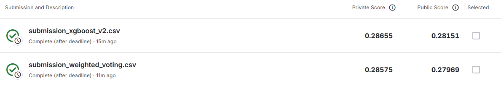
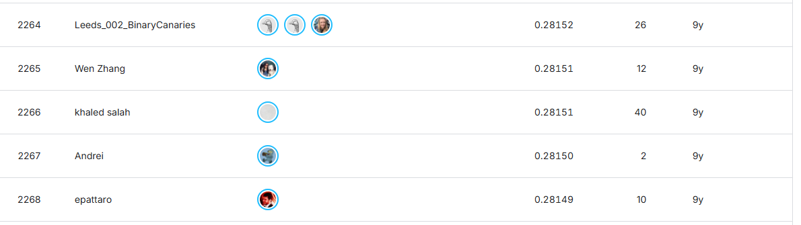

# Porto Seguro Safe Driver Prediction

Решение соревнования [Porto Seguro’s Safe Driver Prediction](https://www.kaggle.com/competitions/porto-seguro-safe-driver-prediction).

## Описание задачи

Необходимо предсказать вероятность того, что владелец автомобиля подаст страховое заявление.

Это задача бинарной классификации:

- `target = 1` — страховой случай произойдёт;
- `target = 0` — страхового случая не произойдёт.

Основная метрика соревнования — **Normalized Gini Coefficient**:

## Работа с данными
- удаление исходных признаков `ps_calc_*`;
- сохранение значения `-1` как информации о пропуске;
- добавление `num_missing_count` и `cat_missing_count`;
- добавление `ind_bin_sum` и `calc_bin_sum`;
- подбор гиперпараметров с помощью `GridSearchCV`;
- One-Hot Encoding категориальных признаков для моделей, которым он необходим;
- масштабирование числовых признаков для Logistic Regression;

## Что не сработало
- Замена категориальных пропусков модой.
- Замена числовых пропусков медианой.
- Добавление отдельных индикаторов для каждого пропуска.
- Удаление всех бинарных признаков.
- Использование только бинарных агрегатов без исходных признаков.
- Использование только признаков `ps_calc_*`.
- Blending, weighted voting и stacking не превзошли отдельный настроенный XGBoost.

## Итоговый результат

Лучший результат показал отдельно обученный **XGBoost** после feature engineering и подбора гиперпараметров.

| Решение | Public Score | Private Score |
|---|---:|---:|
| Первый XGBoost baseline | 0.27785 | 0.28089 |
| Финальный XGBoost | **0.28151** | **0.28655** |
| Прирост | **+0.00366** | **+0.00566** |

- **Kaggle username:** `TM_Lechik`
- **Место в лидерборде:** `2265`
- **Финальный submission:** `submission_xgboost_v2.csv`

## Скриншот результата

## Предполагаемое место в лидерборде 2265

!
